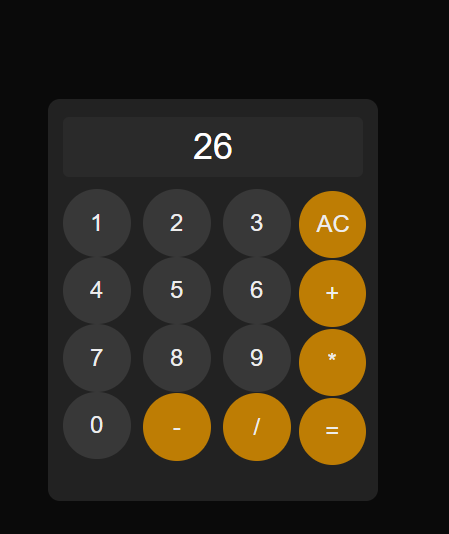

## Calculator

A calculator project I built from scratch using both vanilla JavaScript and the Next.js React framework.

## What i learned

I learned about DOM, function parsing objects in a Input, about boucle For, For each, i also learn about React how to handle proprely different type for function. 

